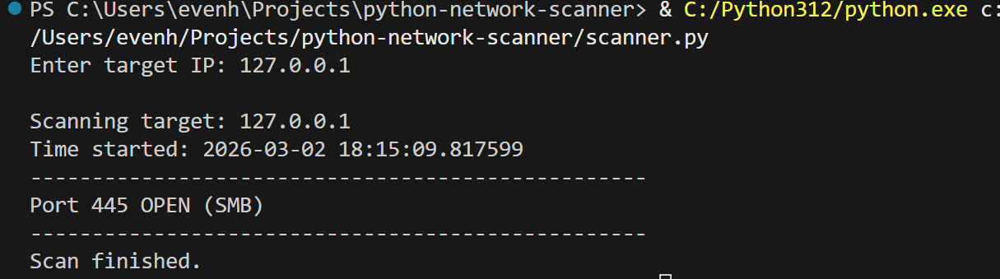

# Python Network Scanner

A lightweight network scanner written in Python that scans common TCP ports and identifies running services on a target machine.

## Features

- Scans commonly used ports (SMB, SSH, HTTP, RDP, etc.)
- Displays open ports and associated service names
- Fast and simple implementation using Python sockets
- Useful for learning network enumeration, port scanning, and basic cybersecurity concepts

## Example

## Usage

1. Run the script:

python scanner.py

2. Enter the target IP address when prompted.

Example:

127.0.0.1

## Technologies Used

- Python 3
- Socket programming
- TCP/IP networking

## Purpose

This project was created to practice network scanning techniques and to better understand how services are exposed on a network.

## Author

Even Hynden Torkildsrud  
Bachelor in Information Technology – Cybersecurity